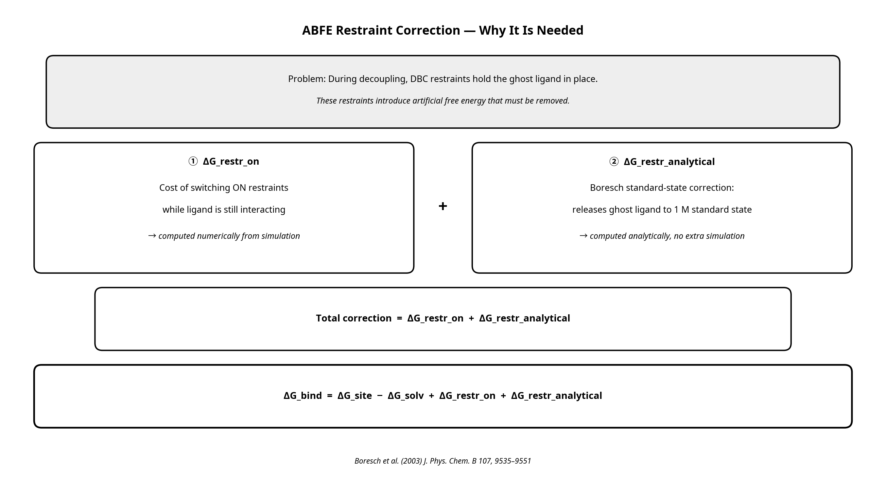

# NAMD 3.0.2 ABFE Replica Exchange Guide

A practical guide for compiling NAMD 3.0.2 from source and running CHARMM-GUI generated Absolute Binding Free Energy (ABFE) simulations on workstations with limited CPU resources.

## Motivation

The [CHARMM-GUI Free Energy Calculator](https://www.charmm-gui.org/input/fec) [1] provides an automated pipeline for generating ABFE inputs for NAMD. In practice, two barriers prevent many researchers from using it directly:

1. **Hardware constraints.** The default CHARMM-GUI ABFE configuration requires 32 CPUs — one per lambda window. Most workstations have fewer cores.
2. **Compilation complexity.** Pre-built NAMD binaries do not support replica exchange. Compiling NAMD from source with the correct Charm++ backend is non-trivial and error-prone, especially for non-coding users.

This repository solves both issues. It documents the full compilation process (including all errors encountered and their fixes), and provides tools to automatically scale the CHARMM-GUI scripts to match your available CPU count.

> **Important:** Reducing the number of simultaneously active replicas does **not** change the lambda window values themselves — all 32 lambda states are still sampled. However, fewer replicas means longer round-trip times across lambda space, which slows convergence. The default step count in the CHARMM-GUI scripts is generally sufficient, but be aware that running fewer replicas may result in a slight decrease in statistical accuracy compared to a full 32-replica run. See [Accuracy and Speed Trade-offs](#accuracy-and-speed-trade-offs) below.

---

## Background: What is ABFE?

Absolute Binding Free Energy (ABFE) calculations use alchemical Free Energy Perturbation (FEP) to compute the binding affinity (ΔG_bind) of a ligand to a protein. Because directly simulating the physical binding event is computationally intractable, ABFE uses a **thermodynamic cycle** based on two non-physical ("alchemical") transformations:

1. **Complex (site) leg:** The ligand is gradually decoupled (turned into a non-interacting ghost) while bound in the protein pocket → yields ΔG_site.
2. **Solvation (solv) leg:** The ligand is gradually decoupled while free in water → yields ΔG_solv.

### The Complete ABFE Equation

A critical but often overlooked aspect is the **restraint correction**. During decoupling, harmonic restraints (DBC restraints in CHARMM-GUI, based on the Boresch scheme [2]) are applied to keep the ghost ligand in the binding pose. These restraints introduce an artificial free energy contribution that must be explicitly corrected:

```
ΔG_bind = ΔG_site − ΔG_solv + ΔG_restr_on + ΔG_restr_analytical
```

where:

| Term | Description | How computed |
|:---|:---|:---|
| `ΔG_site` | Free energy of decoupling ligand from protein (elec + vdW) | Numerically, from REMD/BAR |
| `ΔG_solv` | Free energy of decoupling ligand from water (elec + vdW) | Numerically, from REMD/BAR |
| `ΔG_restr_on` | Free energy cost of **applying** DBC restraints while ligand is still interacting | Numerically, from simulation |
| `ΔG_restr_analytical` | Boresch standard-state correction: releases the restrained ghost ligand to 1 M standard concentration | Analytically, from restraint force constants |

The Boresch analytical correction [2] accounts for the fact that the restrained decoupled ligand does not correspond to the standard state concentration (1 M = 1/1660 ų). It is computed from the equilibrium values and force constants of the six restraint terms (1 distance + 2 angles + 3 dihedrals) and requires no additional simulation.


**Figure 1:** ABFE thermodynamic cycle. The dashed top arrow (ΔG_bind) is the target quantity and is not simulated directly. The two solid vertical/horizontal arrows represent the alchemical legs simulated by NAMD.



**Figure 2:** Restraint correction scheme. The artificial free energy introduced by the DBC restraints during decoupling must be explicitly removed using both numerical and analytical terms.

**References for the diagram:**
- [1] Kim et al. (2020) *J. Chem. Theory Comput.* 16, 7207–7218 — CHARMM-GUI Free Energy Calculator
- [2] Boresch et al. (2003) *J. Phys. Chem. B* 107, 9535–9551 — Restraint correction analytical formula

---

## Compiling NAMD 3.0.2 for Replica Exchange

### Why `netlrts`?

The standard `multicore` NAMD build **does not support** partition-based replica exchange (`+replicas`). According to the NAMD source documentation, multi-copy algorithms require a Charm++ build using an LRTS (low-level run-time system) machine layer. For a single multi-core workstation, **`netlrts-linux-x86_64`** is the correct and officially supported choice. It uses `charmrun ++local` to launch multiple processes locally without SSH or MPI.

### Prerequisites (Ubuntu 22.04)

```bash
sudo apt-get update
sudo apt-get install -y build-essential csh tcl-dev tcl8.6-dev libfftw3-dev wget tar
```

### Step 1: Build Charm++ (netlrts backend)

```bash
cd NAMD_3.0.2_Source
tar xf charm-8.0.0.tar
cd charm-8.0.0
./build charm++ netlrts-linux-x86_64 --with-production -j4
```

### Step 2: Configure NAMD

```bash
cd ../
cp arch/Linux-x86_64-g++.arch arch/Linux-x86_64-g++-netlrts.arch
# Edit arch/Linux-x86_64-g++-netlrts.arch and set:
#   CHARMARCH = netlrts-linux-x86_64
./config Linux-x86_64-g++-netlrts --with-fftw3 --with-tcl
```

### Step 3: Fix Make.config and Compile

The pre-built UIUC FFTW/TCL libraries fail to link on modern Ubuntu (missing `-fPIC`). Use system libraries instead. Edit `Linux-x86_64-g++-netlrts/Make.config`:

```
TCLDIR  = /usr
TCLINCL = -I/usr/include/tcl8.6
TCLLIB  = -L/usr/lib/x86_64-linux-gnu -ltcl8.6

FFTDIR  = /usr
FFTINCL = -I/usr/include
FFTLIB  = -L/usr/lib/x86_64-linux-gnu -lfftw3f
```

Then compile:

```bash
cd Linux-x86_64-g++-netlrts
make -j4
```

For a full list of compilation errors encountered and their fixes, see [docs/01_compilation_errors_and_fixes.md](docs/01_compilation_errors_and_fixes.md).

---

## CPU Advisor: How Many Replicas Should I Use?

`lscpu` reports **logical CPUs** (physical cores × hyperthreading factor). For NAMD, only **physical cores** provide real floating-point throughput. The `scripts/namd_cpu_advisor.py` utility parses `lscpu`, extracts the physical core count, and recommends the optimal `+replicas` / `+p` configuration.

```bash
python3 scripts/namd_cpu_advisor.py                       # auto-detect
python3 scripts/namd_cpu_advisor.py --physical-cores 14   # manual override
python3 scripts/namd_cpu_advisor.py --lscpu-file lscpu.txt # from saved file
```

**Core rule:** `+p` (total CPUs) must be exactly divisible by `+replicas`. Example for 14 physical cores:

| `+replicas` | `+p` | PE/replica | Recommendation |
|:-----------:|:----:|:----------:|:---|
| 7 | 14 | 2 | **Best** — each replica runs 2-threaded (faster MD) |
| 14 | 14 | 1 | Good — more lambda coverage, but single-threaded per replica |
| 2 | 14 | 7 | Not recommended — too few replicas to efficiently traverse lambda space |

---

## Adapting CHARMM-GUI Scripts for Fewer Replicas

When reducing from 32 to `N` replicas, update these 5 files in both `complex/` and `ligand/` directories:

| File | What to change |
|:---|:---|
| `fep_site.conf` / `fep_solv.conf` | `set num_replicas N` and `set num_replicasb N` |
| `1_mkdir.pl` | Loop upper bound: `for ($j = 0; $j < N; $j++)` |
| `3_job_run.pbs` | `+replicas N` in the launch command |
| `sort.py` | `num_replica = N` (also fix Python 2 `print` → Python 3) |
| `calc_fe.pl` | `$fep_win_num = N` |

Alternatively, use the provided helper script which automatically creates the directories, generates a scaled configuration file on the fly, and launches the REMD job:

```bash
# Usage: bash run_abfe_remd.sh <leg> <nreplicas> <ncpus> <num_runs> <steps_per_run>
bash scripts/run_abfe_remd.sh site 7 14 1000 1000
```

---

## Running the ABFE Workflow

### Equilibration

```bash
/path/to/namd3 +p4 equ_site.namd > equ_site.log
/path/to/namd3 +p4 equ_solv.namd > equ_solv.log
```

### Replica Exchange FEP

```bash
/path/to/charmrun ++local +p14 /path/to/namd3 \
  +replicas 7 fep_site.conf \
  --source FEP_remd_softcore.namd \
  +stdout output_site/%d/job0.%d.log > remd_site.log 2>&1
```

### Analysis

```bash
python3 scripts/sort_replicas.py --leg site --replicas 7
python3 scripts/calc_bar_fe.py   --leg site --replicas 7
```

---

## Accuracy and Speed Trade-offs

Reducing the number of simultaneously active replicas (e.g., from 32 to 7) does **not** reduce the theoretical accuracy of the final ΔG_bind value, because all 32 lambda windows are still sampled. However:

- **Convergence is slower.** With fewer replicas, a configuration takes longer to traverse the full λ = 0 → 1 path via REMD exchanges, making it harder to escape kinetic traps (e.g., trapped water molecules or sidechain rotamers near the binding site).
- **Compensation:** While the default step count in the CHARMM-GUI scripts is usually fine, achieving the exact same statistical convergence (error bar) as a 32-replica run would technically require running more MD steps per replica.

For a detailed discussion with literature references, see [docs/02_replica_scaling_guide.md](docs/02_replica_scaling_guide.md).

---

## References

[1] Kim, S., Oshima, H., Zhang, H., Kern, N. R., Re, S., Lee, J., Roux, B., Sugita, Y., Jiang, W., & Im, W. (2020). CHARMM-GUI Free Energy Calculator for Absolute and Relative Ligand Solvation and Binding Free Energy Simulations. *J. Chem. Theory Comput.*, 16(11), 7207–7218. https://doi.org/10.1021/acs.jctc.0c00884

[2] Boresch, S., Tettinger, F., Leitgeb, M., & Karplus, M. (2003). Absolute Binding Free Energies: A Quantitative Approach for Their Calculation. *J. Phys. Chem. B*, 107(35), 9535–9551. https://doi.org/10.1021/jp0217839

[3] Boresch, S. (2024). On Analytical Corrections for Restraints in Absolute Binding Free Energy Calculations. *J. Chem. Inf. Model.*, 64(9), 3808–3820. https://doi.org/10.1021/acs.jcim.4c00442

[4] Phillips, J. C., et al. (2020). Scalable molecular dynamics on CPU and GPU architectures with NAMD. *J. Chem. Phys.*, 153, 044130. https://doi.org/10.1063/5.0014475
