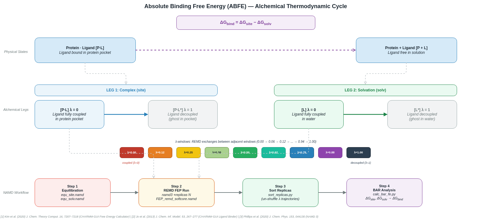

# NAMD 3.0.2 ABFE Replica Exchange Guide

This repository provides a comprehensive guide for compiling NAMD 3.0.2 from source to support Replica Exchange Molecular Dynamics (REMD) and adapting CHARMM-GUI Absolute Binding Free Energy (ABFE) scripts to run on systems with limited CPU resources.

### Motivation
The CHARMM-GUI Free Energy Calculator [1] provides an excellent, automated pipeline for generating ABFE inputs. However, running these calculations in practice presents two major hurdles for many researchers:
1. **Hardware Constraints:** The default CHARMM-GUI ABFE configuration requires 32 CPUs (one for each $\lambda$ window). Many users do not have access to 32-core workstations or large HPC clusters.
2. **Compilation Complexity:** The standard NAMD binaries do not support the required replica exchange features. Compiling NAMD from source with the correct Charm++ backend (`netlrts`) is complex, error-prone, and often beyond the comfort zone of non-coding audiences.

This repository solves both issues by providing a step-by-step guide to successfully compiling NAMD with replica exchange support, and a set of tools to automatically scale down the CHARMM-GUI scripts to run on fewer CPUs (e.g., 4, 8, or 14 cores) without breaking the simulation.

## Table of Contents
1. [Background: What is ABFE?](#1-background-what-is-abfe)
2. [Compiling NAMD 3.0.2 for Replica Exchange](#2-compiling-namd-302-for-replica-exchange)
3. [CPU Advisor: How Many Replicas Should I Use?](#3-cpu-advisor-how-many-replicas-should-i-use)
4. [Adapting CHARMM-GUI ABFE Scripts for Fewer CPUs](#4-adapting-charmm-gui-abfe-scripts-for-fewer-cpus)
5. [Running the ABFE Workflow](#5-running-the-abfe-workflow)
6. [Analysis and Free Energy Calculation](#6-analysis-and-free-energy-calculation)

---

## 1. Background: What is ABFE?

Absolute Binding Free Energy (ABFE) calculations use alchemical Free Energy Perturbation (FEP) to compute the binding affinity ($\Delta G_{bind}$) of a ligand to a protein. Because simulating the physical binding process directly is computationally intractable, ABFE uses a **thermodynamic cycle** to calculate the free energy difference between two non-physical ("alchemical") transformations:

1. **Complex (site) leg:** The ligand is gradually decoupled (turned into a non-interacting "ghost") while bound in the protein pocket. This yields $-\Delta G_{site}$.
2. **Solvation (solv) leg:** The ligand is gradually decoupled while free in water. This yields $-\Delta G_{solv}$.

The binding free energy is then calculated as:
**$\Delta G_{bind} = \Delta G_{site} - \Delta G_{solv}$**

To ensure accurate sampling, the decoupling process is split into multiple discrete steps (lambda windows, typically 32). **Replica Exchange Molecular Dynamics (REMD)** is used to run all windows simultaneously and periodically swap configurations between adjacent windows, preventing the simulation from getting trapped in local energy minima.



---

## 2. Compiling NAMD 3.0.2 for Replica Exchange

### Why `netlrts`?
The standard `multicore` build of NAMD **does not support** partition-based replica exchange (`+replicas`). According to the NAMD 3.0 User Guide and source documentation, multi-copy algorithms require a Charm++ build based on an "LRTS" (low-level run-time system) machine layer. 

For a single multi-core workstation (SMP node), **`netlrts-linux-x86_64`** is the officially recommended and supported architecture for replica exchange. It uses `charmrun ++local` to launch multiple processes on the same machine without requiring SSH or MPI.

### Prerequisites (Ubuntu 22.04)
Install the required build dependencies:
```bash
sudo apt-get update
sudo apt-get install -y build-essential csh tcl-dev tcl8.6-dev libfftw3-dev wget tar
```

### Step 1: Build Charm++ (netlrts backend)
Download the NAMD 3.0.2 source tarball and extract it. Then build the Charm++ backend:
```bash
cd NAMD_3.0.2_Source
tar xf charm-8.0.0.tar
cd charm-8.0.0
./build charm++ netlrts-linux-x86_64 --with-production -j4
```

### Step 2: Configure NAMD
Create an architecture file for the `netlrts` build by copying the standard `g++` file:
```bash
cd ../
cp arch/Linux-x86_64-g++.arch arch/Linux-x86_64-g++-netlrts.arch
```
Edit `arch/Linux-x86_64-g++-netlrts.arch` and update the `CHARMARCH` line:
```text
CHARMARCH = netlrts-linux-x86_64
```

Configure NAMD to use the system's FFTW3 and TCL libraries (the pre-built UIUC libraries often fail to link on modern Ubuntu due to missing `-fPIC` flags):
```bash
./config Linux-x86_64-g++-netlrts --with-fftw3 --with-tcl
```

### Step 3: Fix Make.config and Compile
Edit the generated `Linux-x86_64-g++-netlrts/Make.config` to point to the system libraries:
```text
TCLDIR = /usr
TCLINCL = -I/usr/include/tcl8.6
TCLLIB = -L/usr/lib/x86_64-linux-gnu -ltcl8.6

FFTDIR = /usr
FFTINCL = -I/usr/include
FFTLIB = -L/usr/lib/x86_64-linux-gnu -lfftw3f
```
*(Note: NAMD requires the single-precision FFTW3 library, `libfftw3f`)*

Compile NAMD:
```bash
cd Linux-x86_64-g++-netlrts
make -j4
```
The resulting binary `namd3` and the Charm++ launcher `charmrun` (located in `charm-8.0.0/netlrts-linux-x86_64/bin/charmrun`) will be used to run the REMD simulations.

---

## 3. CPU Advisor: How Many Replicas Should I Use?

`lscpu` reports **logical CPUs**, which includes hyperthreaded virtual cores. For MD simulations, only **physical cores** provide real floating-point throughput. Using hyperthreaded logical CPUs does not speed up NAMD and can slow it down due to cache contention.

The `scripts/namd_cpu_advisor.py` utility automatically parses `lscpu` output, extracts the physical core count, and recommends the optimal `+replicas` / `+p` configuration.

### Usage
```bash
# Auto-detect from lscpu (Linux)
python3 scripts/namd_cpu_advisor.py

# Parse a saved lscpu output file
python3 scripts/namd_cpu_advisor.py --lscpu-file /path/to/lscpu.txt

# Override manually if you know your physical core count
python3 scripts/namd_cpu_advisor.py --physical-cores 14
```

### Example: Machine with 28 logical CPUs (14 physical cores, hyperthreading ON)
```
=================================================================
  NAMD ABFE REMD — CPU Configuration Advisor
=================================================================
  Logical CPUs (lscpu)   : 28
  Threads per core       : 2  (hyperthreading enabled)
  Sockets                : 1
  *** Physical cores     : 14  ← use this for NAMD ***

  NOTE: lscpu reports 28 logical CPUs, but only 14
  are real physical cores. Using all 28 logical CPUs would
  NOT speed up NAMD and may slow it down due to cache contention.
  Always set +p14 (physical cores only).

  Valid configurations for +p14:

  Rank  +replicas    +p       PE/replica     Recommendation
  ---- ----------- ------- ------------- -----------------------------------
  1     7            14       2              <-- BEST (most accurate + fast)
  2     2            14       7              <-- Good alternative
  3     14           14       1              Works; each replica single-threaded (slow)

  RECOMMENDED LAUNCH COMMAND:
    charmrun ++local +p14 namd3 \\
      +replicas 7 fep_site.conf \\
      --source FEP_remd_softcore.namd \\
      +stdout output_site/%d/job0.%d.log
=================================================================
```

### Ranking Logic
The advisor ranks configurations by two criteria, in order:
1. **PE per replica ≥ 2** is preferred over 1 PE per replica. Each replica's MD simulation runs faster when it has at least 2 threads.
2. **More replicas** is preferred over fewer (within the same PE group), because more lambda windows improve phase-space overlap and BAR accuracy.

---

## 4. Adapting CHARMM-GUI ABFE Scripts for Fewer CPUs

The default CHARMM-GUI ABFE workflow uses **32 replicas** (lambda windows). NAMD's `+replicas N` flag requires that the total number of Processing Elements (PEs) is a multiple of N. If you have fewer than 32 CPUs (e.g., a 4-core or 8-core workstation), you cannot run 32 replicas efficiently.

You can downgrade the number of replicas (e.g., to 4, 8, or 16) to match your CPU count. This sacrifices some accuracy and phase-space overlap but allows the simulation to run.

### Required Script Modifications

If you reduce the number of replicas from 32 to `N` (e.g., `N=4`), you must update the following files in both the `complex/` and `ligand/` directories:

#### 1. `fep_site.conf` / `fep_solv.conf`
Update the replica counts:
```tcl
set num_replicas 4      # Change from 32
set num_replicasb 4     # Change from 32
```

#### 2. `1_mkdir.pl`
Update the loop limits for directory creation:
```perl
for ($j = 0; $j < 4; $j++) {  # Change from 32
    system("mkdir output_site/$j");
}
for ($j = 0; $j < 4; $j++) {  # Change from 32
    system("mkdir output_off/$j");
}
```

#### 3. `3_job_run.pbs` (or your launch script)
Update the `+replicas` flag in the NAMD launch commands:
```bash
namd2 +replicas 4 fep_${system}.conf ...      # Change from 32
namd2 +replicas 4 restart_${cnt}.conf ...     # Change from 32
```

#### 4. `sort.py`
Update the hardcoded replica count:
```python
num_replica = 4  # Change from 32
```
*(Note: The default `sort.py` uses Python 2 syntax `print time`. If using Python 3, update it to `print(time)`).*

#### 5. `calc_fe.pl`
Update the FEP window number:
```perl
$fep_win_num = 4;  # Change from 32
```

---

## 5. Running the ABFE Workflow

With the scripts adapted, run the workflow using the `netlrts` NAMD build.

### Equilibration
Run the standard equilibration first (does not require `charmrun`):
```bash
/path/to/namd3 +p4 equ_site.namd > equ_site.log
```

### Replica Exchange (REMD)
Launch the REMD simulation using `charmrun ++local` (which runs the network backend locally without SSH):
```bash
/path/to/charmrun ++local +p4 /path/to/namd3 +replicas 4 fep_site.conf \
  --source FEP_remd_softcore.namd \
  +stdout output_site/%d/job0.%d.log > remd_site.log 2>&1
```
*(Replace `+p4` with your actual CPU count. Ensure `+p` is a multiple of `+replicas`).*

---

## 6. Analysis and Free Energy Calculation

After the REMD simulation completes, run the analysis scripts to calculate the Bennett Acceptance Ratio (BAR) free energy.
1. **Sort the trajectories by lambda window:**
   ```bash
   perl 4_sort.pl
   ```
   *(Or use the `sort_replicas.py` script provided in this repo if you changed the replica count).*

2. **Calculate the free energy:**
   ```bash
   perl 5_fe.pl
   ```
   *(Or use the `calc_bar_fe.py` script provided in this repo).*

---

## References

[1] Kim, S., Oshima, H., Zhang, H., Kern, N. R., Re, S., Lee, J., Roux, B., Sugita, Y., Jiang, W., & Im, W. (2020). CHARMM-GUI Free Energy Calculator for Absolute and Relative Ligand Solvation and Binding Free Energy Simulations. *Journal of Chemical Theory and Computation*, 16(11), 7207–7218. https://doi.org/10.1021/acs.jctc.0c00884

Repeat the entire process for both the `complex` (site) and `ligand` (solvation) legs. The Absolute Binding Free Energy is:
**ΔG_bind = ΔG_site - ΔG_solv**
